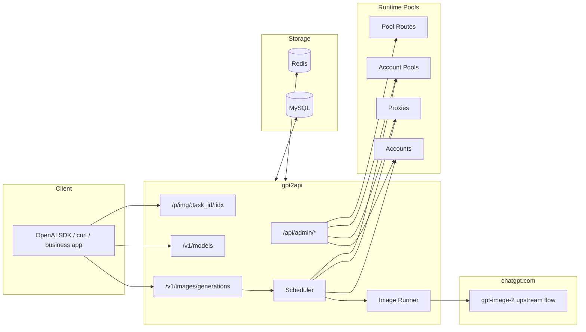

# gpt2api

> 面向 `gpt-image-2` 的图片账号池网关：管理员后台、账号池、代理池、调度器、图片代理一体化。

<p align="center">
  <a href="https://github.com/432539/gpt2api/stargazers"></a>
  <a href="https://github.com/432539/gpt2api/releases"></a>
  <a href="https://golang.org/"></a>
  <a href="https://vuejs.org/"></a>
  <a href="https://github.com/432539/gpt2api/blob/main/LICENSE"></a>
</p>

- 仓库地址：<https://github.com/432539/gpt2api>
- 技术交流 QQ 群：`382446`

---

## 当前定位

当前主线已经从“OpenAI 兼容 SaaS 网关”收口为**图片账号池服务**。

当前明确保留：

- 对外图片接口
  - `POST /v1/images/generations`
  - `GET /v1/models`
  - `GET /p/img/:task_id/:idx`
- 管理后台
  - 管理员登录
  - GPT 账号管理
  - 代理管理
  - 账号池管理
  - 模型池路由管理
  - 最小系统设置
  - 远程导入源管理（Sub2API / CPA）
- 运行时内核
  - 账号调度
  - 主池 / fallback 池路由
  - 账号刷新与额度探测
  - 图片代理下载

当前不再作为主线目标：

- 普通用户中心
- 用户 API Key 自助管理
- 充值、积分、账单
- 文本聊天 `/v1/chat/completions`
- 图生图编辑接口 `/v1/images/edits`
- 异步任务查询 `/v1/images/tasks/:id`

---

## 核心能力

### 1. 图片网关

- 对外兼容 `gpt-image-2`
- `/v1/models` 收口为图片模型视图
- `/p/img/...` 统一做图片代理，避免上游直链失效

### 2. 账号池调度

- 支持模型路由到主池
- 支持主池无可用成员时 fallback
- 只在池成员范围内调度账号
- 成员 `enabled / priority / weight / max_parallel` 进入运行时

### 3. 账号治理

- 手工创建账号
- JSON / Access Token / Refresh Token / Session Token 导入
- 远程导入源：
  - Sub2API
  - CPA
- 自动刷新
- 额度探测
- 账号绑定代理

### 4. 管理后台

当前前端只保留：

- `/login`
- `/admin/accounts`
- `/admin/proxies`
- `/admin/account-pools`
- `/admin/account-pool-routes`
- `/admin/settings`

---

## 架构概览



---

## 快速开始

### 1. 准备环境

- Go 1.22+
- Node.js 20+
- MySQL 8
- Redis 7

### 2. 本地开发

```bash
git clone https://github.com/432539/gpt2api.git
cd gpt2api

cp configs/config.example.yaml configs/config.yaml

go run ./cmd/server -c configs/config.yaml
```

前端开发：

```bash
cd web
npm ci
npm run dev
```

### 3. Docker 部署

```bash
cd deploy
cp .env.example .env
docker compose up -d --wait
```

---

## 关键配置

配置示例见：

- `configs/config.example.yaml`
- `deploy/.env.example`

重点关注：

- MySQL / Redis 连接
- JWT 密钥
- AES 密钥
- 网关静态 Bearer Token
- 默认图片池 / fallback 池
- 代理探测参数
- 账号刷新 / 额度探测参数

---

## 管理后台页面

### 账号

- 列表
- 状态筛选
- 绑定代理
- 刷新全部
- 探测额度
- 批量删除
- 账号导入

### 代理

- 新建 / 编辑 / 删除
- 批量导入
- 单个探测 / 全量探测

### 账号池

- 新建池
- 编辑池
- 删除池
- 维护池成员

### 池路由

- 为模型配置主池
- 配置 fallback 池

### 设置

- 最小系统配置
- 刷新与调度参数

---

## 常用验证命令

### 后端

```bash
go vet ./...
go test ./...
make build
```

### 前端

```bash
cd web
npm ci
npm run build
```

### 部署产物

```bash
bash deploy/build-local.sh
```

### 冒烟脚本语法检查

```bash
node --check scripts/smoke.mjs
```

---

## 产物路径

- 本地二进制：`bin/gpt2api`
- 部署二进制：`deploy/bin/gpt2api`
- Goose：`deploy/bin/goose`
- 前端构建：`web/dist/`

---

## 相关文档

并行改造与设计文档：

- `docs/parallel-tasks/plans/01-image-only-admin-slimming-design.md`
- `docs/parallel-tasks/plans/02-account-pool-runtime-gap-design.md`
- `docs/parallel-tasks/plans/03-image-only-account-pool-refactor-plan.md`
- `docs/parallel-tasks/results/01-image-only-admin-slimming-design.md`
- `docs/parallel-tasks/results/02-account-pool-runtime-gap-design-workthrough.md`
- `docs/parallel-tasks/results/03-image-only-account-pool-refactor-plan.md`

---

## License

MIT
